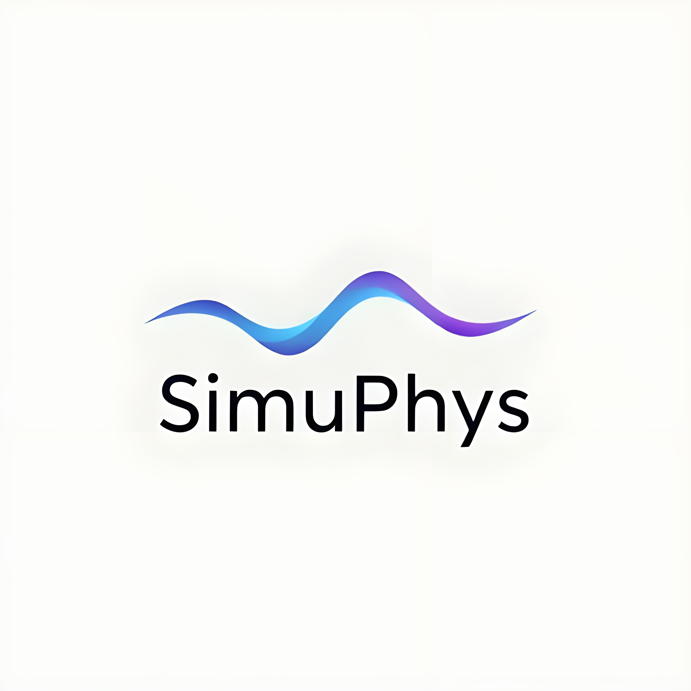

# SimuPhys ⚛️



**An Interactive Toolkit for Visualizing Classical and Quantum Physics Simulations**

SimuPhys is an open-source, interactive simulation toolkit designed to visually demonstrate key physics phenomena across classical and quantum domains. This project focuses on making complex concepts accessible through user-driven, dynamic visualizations built with Python.

## 🚀 Features

SimuPhys brings a wide range of physics simulations to life, allowing for interactive and intuitive learning. The toolkit covers topics in Classical Mechanics, Electromagnetism, and Quantum Mechanics.

### Classical Mechanics
* **Projectile Motion:** A full-featured simulator for projectile motion that includes parameters like initial velocity, angle, height, gravity, wind, air density, and drag.
* **Oscillation Variations:** Visualize undamped, damped, and overdamped oscillations with a synchronized 3D object and a corresponding wave plot.
* **Vector Algebra:** An interactive tool to visualize 3D vector fields, their divergence, and their curl.

### Electromagnetism
* **Electromagnetic Waves:** A 3D simulation showing how an oscillating charge emits electromagnetic waves, with visualizations for both the E and B fields.
* **Laplace Plots:** A 2D Laplace equation solver that visualizes the potential surface based on user-defined boundary conditions.

### Quantum Mechanics
* **Schrödinger Wave Equation:** A 3D simulation of a Gaussian wave packet for a free particle, showing its time evolution, translation, and dispersion.
* **Quantum Fourier Transform (QFT):** A simulator that visualizes the QFT on an initial quantum state, showing the initial and final states on Bloch spheres and the final probability distribution.

## 🛠️ Tech Stack

The application is built using Python and a combination of powerful open-source libraries for scientific computing, visualization, and web deployment.

* **Core Libraries:** NumPy, SciPy, SymPy
* **Visualization:** Plotly, Matplotlib
* **Quantum Computing:** Qiskit
* **Web Framework:** Streamlit
* **UI/UX:** HTML, CSS, JavaScript, Three.js

## 🏛️ System Architecture

The system is designed with a modular architecture, separating the core logic from the user interface and visualization layers.


* **UI Layer:** Built with Streamlit for the web interface and PyQt5 for a potential local GUI.
* **Visualization Layer:** Utilizes Plotly, Matplotlib, and Manim to create interactive plots and animations.
* **Calculation Engine:** Powered by NumPy and SciPy for efficient numerical computations.
* **Simulation Layer:** Uses SymPy and Manim for symbolic mathematics and simulation logic.
* **Quantum Module:** Leverages Qiskit for quantum computations and simulations.

## 🏁 Getting Started

To get a local copy up and running, follow these simple steps.

### Prerequisites

* Python 3.8 or higher
* pip

### Installation

1.  **Clone the repo**
    ```sh
    git clone [https://github.com/gupta-kartik7658/simuphys.git](https://github.com/gupta-kartik7658/simuphys.git)
    ```
2.  **Navigate to the project directory**
    ```sh
    cd simuphys
    ```
3.  **Install the required packages**
    ```sh
    pip install -r requirements.txt
    ```

### Running the Application

1.  **Run the Streamlit app**
    ```sh
    streamlit run app.py
    ```
2.  Open your web browser and navigate to the local URL provided by Streamlit (usually `http://localhost:8501`).

## usage

Upon launching the application, you will be greeted with the SimuPhys homepage.

1.  Click the **"Explore Simulations"** button to navigate to the main selection page.
2.  Choose a domain of physics: **Classical Mechanics**, **Electromagnetism**, or **Quantum Mechanics**.
3.  Select a specific simulation from the available options.
4.  Use the sliders, input boxes, and buttons within each simulation to adjust parameters and observe the results in real-time.

## 🧑‍💻 Team

* **Kartik Gupta** - B.Tech (CSE), Indian Institute of Information Technology Vadodara
* **Abhinav Chhajed** - B.Tech (CSE), Indian Institute of Information Technology Vadodara
* **Suraj Singh** - B.Tech (CSE), Indian Institute of Information Technology Vadodara